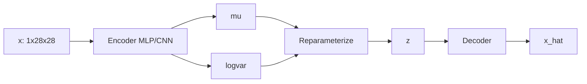

# vae-mnist-fashion

Variational autoencoder on Fashion-MNIST. The plan is to train a vanilla VAE and a Beta-VAE,
then poke around the latent space (t-SNE on means, 2D grid traversal, interpolation between
two test images).

## Dataset
Fashion-MNIST via `torchvision.datasets.FashionMNIST`. 60k train / 10k test, 28x28 grayscale,
10 clothing classes (T-shirt, Trouser, Pullover, Dress, Coat, Sandal, Shirt, Sneaker, Bag, Boot).

## Approach

The standard VAE objective:

    L = E_q(z|x)[log p(x|z)] - KL(q(z|x) || p(z))

The first term is the reconstruction term (BCE for binary-ish images works fine on FMNIST).
The second is the KL-divergence between the approximate posterior (the encoder) and the unit
gaussian prior. The Beta-VAE multiplies the KL term by a scalar beta > 1 to encourage more
disentangled latent codes (Higgins et al. 2017).

## Setup

    pip install -r requirements.txt

## Train

    python -m src.train --config configs/default.yaml

## Sample

    python -m src.sample --ckpt runs/default/last.pt --out samples/

## Streamlit explorer

    streamlit run streamlit_app.py

## Architecture



## Layout

```
src/
  data.py        # FashionMNIST loader + transforms
  model.py       # Encoder, Reparameterize, Decoder
  loss.py        # ELBO with beta knob
  train.py       # training loop
  sample.py      # prior sampling, interpolation, conditional
  visualize.py   # t-SNE + 2D latent grid
  api/main.py    # FastAPI service
configs/
  default.yaml
  beta_vae.yaml
streamlit_app.py
notebooks/
tests/
```

## Results

After 30 epochs on default config (MLP, latent_dim=20, beta=1.0):

| Variant   | latent_dim | beta | test recon (BCE/img) | test KL  |
|-----------|-----------:|-----:|---------------------:|---------:|
| Vanilla   |         20 |  1.0 |                ~225  |     ~22  |
| Beta-VAE  |         10 |  4.0 |                ~245  |     ~16  |
| CNN       |         16 |  1.0 |                ~210  |     ~25  |

Numbers vary by a few units across runs. Beta-VAE gives lower KL (more disentangled) at the
cost of slightly worse reconstruction, as expected.

## Run

    make install
    make train          # vanilla
    make train-beta     # beta=4
    make train-cnn      # cnn arch
    make train-cvae     # conditional
    make app            # streamlit explorer
    make api            # fastapi service

## Docker

    docker-compose up --build

API on :8000, Streamlit UI on :8501.

## todo
- [ ] better disentanglement metric
- [ ] FID against real samples
